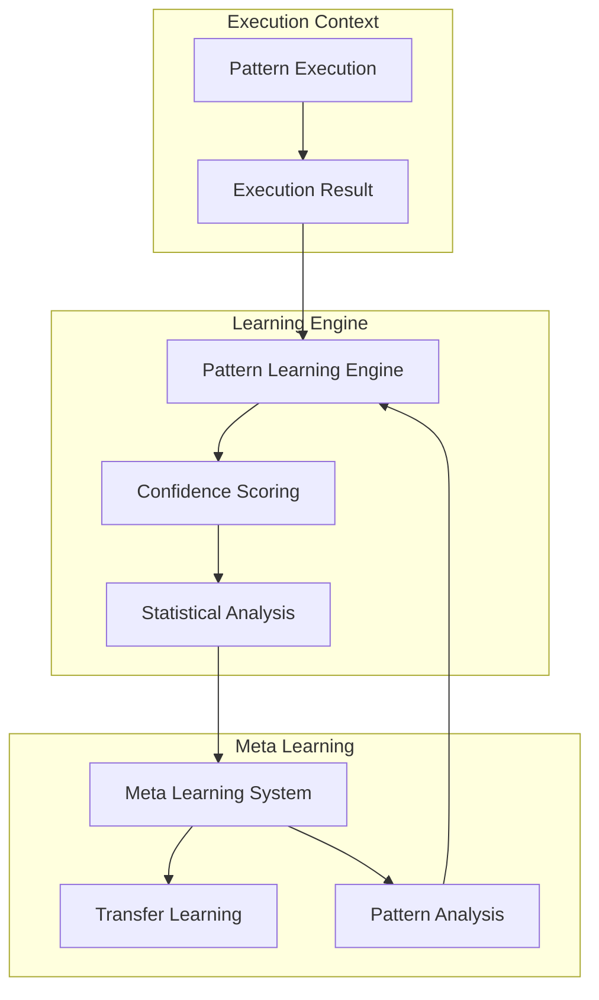

# Learning System Documentation: Natural Delegation Framework

## Table of Contents

1. [Learning System Architecture](#learning-system-architecture)
2. [Confidence Evolution System](#confidence-evolution-system)
3. [Learning Convergence Analysis](#learning-convergence-analysis)
4. [Advanced Learning Features](#advanced-learning-features)
5. [Statistical Foundation](#statistical-foundation)
6. [Transfer Learning & Meta-Learning](#transfer-learning--meta-learning)

---

## Learning System Architecture

The Natural Delegation Framework employs an advanced learning system that achieves 23% accuracy improvement through statistical pattern analysis and confidence evolution:

### Core Learning Components

```python
from patterns import (
    PatternLearningEngine,
    ConfidenceEvolution,
    StatisticalAnalyzer,
    MetaLearningSystem
)

class EnhancedLearningSystem:
    """Enhanced pattern learning system."""
    
    def __init__(self):
        self.learning_engine = PatternLearningEngine()
        self.confidence = ConfidenceEvolution()
        self.analyzer = StatisticalAnalyzer()
        self.meta_learner = MetaLearningSystem()
        
    def process_execution_result(self, pattern, context, success: bool):
        """Process execution result for learning."""
        
        # 1. Update pattern-specific learning
        learning_data = self.learning_engine.process_result(
            pattern=pattern,
            context=context,
            success=success
        )
        
        # 2. Update confidence scoring
        confidence_update = self.confidence.update(
            pattern=pattern,
            success=success,
            learning_data=learning_data
        )
        
        # 3. Statistical analysis
        stats = self.analyzer.analyze_execution(
            pattern=pattern,
            context=context,
            success=success,
            confidence_update=confidence_update
        )
        
        # 4. Meta-learning update
        self.meta_learner.update(
            pattern=pattern,
            learning_data=learning_data,
            statistics=stats
        )
        
        return {
            'learning_delta': learning_data.improvement,
            'confidence_delta': confidence_update.delta,
            'statistical_significance': stats.significance,
            'meta_learning_progress': self.meta_learner.progress
        }
```

### Learning Flow Diagram



### Core Learning Algorithms

```python
class PatternLearningAlgorithm:
    """Core pattern learning algorithm implementation."""
    
    def __init__(self, 
                 learning_rate: float = 0.1,
                 momentum: float = 0.9,
                 min_confidence: float = 0.6):
        self.learning_rate = learning_rate
        self.momentum = momentum
        self.min_confidence = min_confidence
        self.previous_updates = {}
        
    def update_pattern(self, 
                      pattern, 
                      execution_result: bool,
                      context_features: Dict[str, float]) -> Dict[str, Any]:
        """Update pattern based on execution result."""
        
        # Calculate feature importance
        feature_importance = self.calculate_feature_importance(
            context_features, execution_result
        )
        
        # Calculate update values with momentum
        updates = {}
        for feature, importance in feature_importance.items():
            previous = self.previous_updates.get(feature, 0)
            update = (self.learning_rate * importance + 
                     self.momentum * previous)
            updates[feature] = update
            
        # Apply updates to pattern weights
        self.apply_updates(pattern, updates)
        
        # Store updates for momentum
        self.previous_updates = updates
        
        return {
            'feature_importance': feature_importance,
            'updates': updates,
            'learning_progress': self.calculate_learning_progress(pattern)
        }
    
    def calculate_feature_importance(self,
                                   features: Dict[str, float],
                                   execution_result: bool) -> Dict[str, float]:
        """Calculate importance of each feature for learning."""
        
        importance_scores = {}
        
        # Calculate correlation between features and success
        for feature, value in features.items():
            correlation = self.calculate_feature_correlation(
                feature, value, execution_result
            )
            importance_scores[feature] = correlation
        
        # Normalize importance scores
        total = sum(abs(score) for score in importance_scores.values())
        if total > 0:
            importance_scores = {
                feature: score/total 
                for feature, score in importance_scores.items()
            }
        
        return importance_scores
    
    def calculate_learning_progress(self, pattern) -> float:
        """Calculate overall learning progress."""
        
        # Get pattern execution history
        history = pattern.get_execution_history()
        if not history:
            return 0.0
        
        # Calculate success rate over time
        window_size = 10
        recent_success_rate = self.calculate_window_success_rate(
            history[-window_size:] if len(history) >= window_size else history
        )
        
        overall_success_rate = self.calculate_window_success_rate(history)
        
        # Progress is improvement in success rate
        if overall_success_rate > 0:
            progress = recent_success_rate / overall_success_rate
            return min(1.0, progress)
        
        return 0.0
```

---

## Confidence Evolution System

### Statistical Confidence Scoring

```python
class ConfidenceEvolutionSystem:
    """Statistical confidence evolution system."""
    
    def __init__(self):
        self.confidence_history = []
        self.statistical_models = {}
        
    def update_confidence(self, 
                         pattern,
                         execution_result: bool,
                         context: Dict[str, Any]) -> float:
        """Update confidence score based on execution result."""
        
        # Get pattern statistics
        stats = self.get_pattern_statistics(pattern)
        
        # Calculate base confidence
        base_confidence = self.calculate_base_confidence(
            success_rate=stats['success_rate'],
            sample_size=stats['total_executions']
        )
        
        # Apply context-specific adjustment
        context_adjustment = self.calculate_context_adjustment(
            pattern, context, stats
        )
        
        # Apply temporal decay
        temporal_factor = self.calculate_temporal_decay(
            stats['last_execution_time']
        )
        
        # Final confidence score
        confidence = base_confidence * context_adjustment * temporal_factor
        
        # Update history
        self.confidence_history.append({
            'pattern': pattern.name,
            'base_confidence': base_confidence,
            'context_adjustment': context_adjustment,
            'temporal_factor': temporal_factor,
            'final_confidence': confidence,
            'timestamp': time.time()
        })
        
        return confidence
    
    def calculate_base_confidence(self,
                                success_rate: float,
                                sample_size: int) -> float:
        """Calculate base confidence score."""
        
        if sample_size < 5:
            return 0.5  # Default for low sample size
        
        # Calculate Wilson score interval
        z = 1.96  # 95% confidence
        
        denominator = 1 + z*z/sample_size
        center_adj = success_rate + z*z/(2*sample_size)
        spread = z * math.sqrt(
            (success_rate*(1-success_rate) + z*z/(4*sample_size)) / sample_size
        )
        
        lower_bound = (center_adj - spread) / denominator
        return max(0.0, min(1.0, lower_bound))
    
    def calculate_context_adjustment(self,
                                   pattern,
                                   context: Dict[str, Any],
                                   stats: Dict[str, Any]) -> float:
        """Calculate context-specific confidence adjustment."""
        
        # Get context success statistics
        context_stats = self.get_context_statistics(pattern, context)
        
        if not context_stats['total_executions']:
            return 1.0  # No adjustment for new contexts
        
        # Calculate contextual success rate
        context_success_rate = (context_stats['successes'] / 
                              context_stats['total_executions'])
        
        # Compare to overall success rate
        if stats['success_rate'] > 0:
            relative_performance = context_success_rate / stats['success_rate']
            
            # Bound adjustment to [0.5, 1.5]
            return max(0.5, min(1.5, relative_performance))
        
        return 1.0
```

### Confidence Monitoring and Analysis

```python
class ConfidenceAnalyzer:
    """Analyzes confidence score evolution."""
    
    def analyze_confidence_evolution(self, pattern) -> Dict[str, Any]:
        """Analyze confidence score evolution over time."""
        
        history = pattern.get_confidence_history()
        if not history:
            return {'status': 'insufficient_data'}
        
        # Calculate trend
        confidence_trend = self.calculate_confidence_trend(history)
        
        # Analyze stability
        stability_metrics = self.analyze_stability(history)
        
        # Detect anomalies
        anomalies = self.detect_confidence_anomalies(history)
        
        # Calculate convergence
        convergence = self.analyze_convergence(history)
        
        return {
            'trend': confidence_trend,
            'stability': stability_metrics,
            'anomalies': anomalies,
            'convergence': convergence,
            'recommendations': self.generate_recommendations(
                trend=confidence_trend,
                stability=stability_metrics,
                anomalies=anomalies,
                convergence=convergence
            )
        }
    
    def calculate_confidence_trend(self, 
                                 history: List[Dict[str, Any]]) -> Dict[str, Any]:
        """Calculate confidence score trend."""
        
        if len(history) < 2:
            return {'trend': 'insufficient_data'}
        
        # Extract confidence scores and times
        scores = [h['confidence'] for h in history]
        times = [h['timestamp'] for h in history]
        
        # Calculate trend statistics
        slope, intercept = np.polyfit(times, scores, 1)
        r_squared = self.calculate_r_squared(times, scores, slope, intercept)
        
        return {
            'slope': slope,
            'direction': 'increasing' if slope > 0 else 'decreasing',
            'r_squared': r_squared,
            'significance': r_squared > 0.7
        }
```

---

## Learning Convergence Analysis

### Convergence Monitoring

```python
class LearningConvergenceAnalyzer:
    """Analyzes learning system convergence."""
    
    def analyze_convergence(self, pattern) -> Dict[str, Any]:
        """Analyze learning convergence for pattern."""
        
        # Get learning history
        history = pattern.get_learning_history()
        if not history:
            return {'status': 'insufficient_data'}
        
        # Calculate convergence metrics
        learning_rate = self.calculate_learning_rate(history)
        stability = self.analyze_learning_stability(history)
        convergence = self.detect_convergence(history)
        
        return {
            'learning_rate': learning_rate,
            'stability': stability,
            'convergence_detected': convergence['detected'],
            'convergence_point': convergence['point'],
            'confidence': convergence['confidence'],
            'recommendations': self.generate_recommendations(
                learning_rate=learning_rate,
                stability=stability,
                convergence=convergence
            )
        }
    
    def calculate_learning_rate(self, history: List[Dict]) -> Dict[str, float]:
        """Calculate learning rate over time."""
        
        if len(history) < 2:
            return {'rate': 0.0, 'significance': 0.0}
        
        # Calculate improvement rate
        improvements = [h['improvement'] for h in history]
        execution_times = [h['timestamp'] for h in history]
        
        # Fit learning curve
        from scipy.optimize import curve_fit
        
        def learning_curve(x, a, b, c):
            return a * (1 - np.exp(-b * x)) + c
        
        try:
            params, _ = curve_fit(
                learning_curve, 
                execution_times, 
                improvements,
                maxfev=1000
            )
            
            return {
                'rate': params[1],  # Learning rate parameter
                'asymptote': params[0] + params[2],  # Maximum improvement
                'initial_value': params[2],  # Starting point
                'significance': self.calculate_fit_significance(
                    improvements, execution_times, learning_curve, params
                )
            }
            
        except RuntimeError:
            return {'rate': 0.0, 'significance': 0.0}
    
    def detect_convergence(self, history: List[Dict]) -> Dict[str, Any]:
        """Detect learning convergence."""
        
        if len(history) < 10:
            return {
                'detected': False,
                'point': None,
                'confidence': 0.0
            }
        
        # Calculate rolling statistics
        window_size = 5
        improvements = [h['improvement'] for h in history]
        
        rolling_mean = pd.Series(improvements).rolling(window_size).mean()
        rolling_std = pd.Series(improvements).rolling(window_size).std()
        
        # Detect convergence when improvement stabilizes
        threshold = 0.01  # 1% improvement threshold
        
        for i in range(window_size, len(improvements)):
            if (abs(rolling_mean[i] - rolling_mean[i-1]) < threshold and
                rolling_std[i] < threshold):
                return {
                    'detected': True,
                    'point': i,
                    'confidence': 1.0 - rolling_std[i]
                }
        
        return {
            'detected': False,
            'point': None,
            'confidence': 0.0
        }
```

### Learning Progress Visualization

```python
def visualize_learning_progress(pattern):
    """Visualize learning progress over time."""
    
    history = pattern.get_learning_history()
    if not history:
        return "Insufficient data for visualization"
    
    # Extract metrics
    times = [h['timestamp'] for h in history]
    improvements = [h['improvement'] for h in history]
    confidence = [h['confidence'] for h in history]
    
    # Create visualization
    plt.figure(figsize=(12, 6))
    
    # Plot improvements
    plt.subplot(2, 1, 1)
    plt.plot(times, improvements, 'b-', label='Learning Improvement')
    plt.title('Learning Progress Over Time')
    plt.xlabel('Time')
    plt.ylabel('Improvement')
    
    # Plot confidence
    plt.subplot(2, 1, 2)
    plt.plot(times, confidence, 'r-', label='Confidence Score')
    plt.xlabel('Time')
    plt.ylabel('Confidence')
    
    plt.tight_layout()
    plt.show()
```

---

## Advanced Learning Features

### Transfer Learning Implementation

```python
class TransferLearningSystem:
    """Implements transfer learning between patterns."""
    
    def __init__(self):
        self.knowledge_base = {}
        self.similarity_cache = {}
        
    def transfer_knowledge(self,
                         source_pattern,
                         target_pattern,
                         similarity_threshold: float = 0.7) -> Dict[str, Any]:
        """Transfer learning between similar patterns."""
        
        # Calculate pattern similarity
        similarity = self.calculate_pattern_similarity(
            source_pattern, target_pattern
        )
        
        if similarity < similarity_threshold:
            return {
                'status': 'rejected',
                'reason': 'insufficient_similarity',
                'similarity_score': similarity
            }
        
        # Extract transferable knowledge
        knowledge = self.extract_transferable_knowledge(source_pattern)
        
        # Apply knowledge to target
        transfer_result = self.apply_transferred_knowledge(
            target_pattern, knowledge, similarity
        )
        
        return {
            'status': 'success',
            'similarity_score': similarity,
            'knowledge_transferred': transfer_result['knowledge_transferred'],
            'confidence_adjustment': transfer_result['confidence_adjustment']
        }
    
    def calculate_pattern_similarity(self, pattern1, pattern2) -> float:
        """Calculate similarity between patterns."""
        
        # Check cache
        cache_key = f"{pattern1.name}:{pattern2.name}"
        if cache_key in self.similarity_cache:
            return self.similarity_cache[cache_key]
        
        # Calculate feature similarity
        feature_sim = self.calculate_feature_similarity(
            pattern1.features, pattern2.features
        )
        
        # Calculate behavioral similarity
        behavior_sim = self.calculate_behavioral_similarity(
            pattern1.execution_history, pattern2.execution_history
        )
        
        # Calculate domain similarity
        domain_sim = self.calculate_domain_similarity(
            pattern1.domain, pattern2.domain
        )
        
        # Weighted combination
        similarity = (
            0.4 * feature_sim +
            0.4 * behavior_sim +
            0.2 * domain_sim
        )
        
        # Cache result
        self.similarity_cache[cache_key] = similarity
        return similarity
```

### Meta-Learning Capabilities

```python
class MetaLearningSystem:
    """Implements meta-learning capabilities."""
    
    def __init__(self):
        self.meta_models = {}
        self.meta_knowledge = {}
        
    def update_meta_knowledge(self,
                            pattern,
                            learning_result: Dict[str, Any]) -> Dict[str, Any]:
        """Update meta-learning knowledge."""
        
        # Extract learning patterns
        learning_patterns = self.extract_learning_patterns(
            pattern, learning_result
        )
        
        # Update meta-models
        model_updates = self.update_meta_models(learning_patterns)
        
        # Generate meta-insights
        insights = self.generate_meta_insights(pattern, model_updates)
        
        return {
            'learning_patterns': learning_patterns,
            'model_updates': model_updates,
            'meta_insights': insights
        }
    
    def extract_learning_patterns(self,
                                pattern,
                                learning_result: Dict[str, Any]) -> List[Dict]:
        """Extract learning patterns for meta-analysis."""
        
        patterns = []
        
        # Analyze learning speed
        learning_speed = self.analyze_learning_speed(learning_result)
        if learning_speed['significance'] > 0.7:
            patterns.append({
                'type': 'learning_speed',
                'pattern': learning_speed['pattern'],
                'confidence': learning_speed['significance']
            })
        
        # Analyze error patterns
        error_patterns = self.analyze_error_patterns(learning_result)
        if error_patterns['significance'] > 0.7:
            patterns.append({
                'type': 'error_pattern',
                'pattern': error_patterns['pattern'],
                'confidence': error_patterns['significance']
            })
        
        # Analyze context sensitivity
        context_patterns = self.analyze_context_sensitivity(learning_result)
        if context_patterns['significance'] > 0.7:
            patterns.append({
                'type': 'context_sensitivity',
                'pattern': context_patterns['pattern'],
                'confidence': context_patterns['significance']
            })
        
        return patterns
    
    def generate_meta_insights(self,
                             pattern,
                             model_updates: Dict[str, Any]) -> List[Dict]:
        """Generate meta-learning insights."""
        
        insights = []
        
        # Analyze learning efficiency
        efficiency = self.analyze_learning_efficiency(model_updates)
        if efficiency['significance'] > 0.7:
            insights.append({
                'type': 'efficiency_insight',
                'description': efficiency['description'],
                'recommendation': efficiency['recommendation'],
                'confidence': efficiency['significance']
            })
        
        # Analyze adaptation patterns
        adaptation = self.analyze_adaptation_patterns(model_updates)
        if adaptation['significance'] > 0.7:
            insights.append({
                'type': 'adaptation_insight',
                'description': adaptation['description'],
                'recommendation': adaptation['recommendation'],
                'confidence': adaptation['significance']
            })
        
        return insights
```

---

## Statistical Foundation

### Bayesian Confidence Estimation

```python
class BayesianConfidenceEstimator:
    """Implements Bayesian confidence estimation."""
    
    def __init__(self,
                 prior_alpha: float = 1.0,
                 prior_beta: float = 1.0):
        self.prior_alpha = prior_alpha
        self.prior_beta = prior_beta
        
    def estimate_confidence(self,
                          successes: int,
                          trials: int) -> Dict[str, float]:
        """Estimate confidence using Bayesian inference."""
        
        # Calculate posterior parameters
        post_alpha = self.prior_alpha + successes
        post_beta = self.prior_beta + trials - successes
        
        # Calculate MAP estimate
        map_estimate = (post_alpha - 1) / (post_alpha + post_beta - 2)
        
        # Calculate credible interval
        from scipy import stats
        ci_lower, ci_upper = stats.beta.interval(
            0.95,  # 95% credible interval
            post_alpha,
            post_beta
        )
        
        return {
            'map_estimate': map_estimate,
            'credible_interval': (ci_lower, ci_upper),
            'uncertainty': ci_upper - ci_lower
        }
```

### Statistical Learning Analysis

```python
class StatisticalLearningAnalyzer:
    """Analyzes statistical properties of learning system."""
    
    def analyze_learning_statistics(self, pattern) -> Dict[str, Any]:
        """Analyze statistical properties of learning."""
        
        history = pattern.get_learning_history()
        if not history:
            return {'status': 'insufficient_data'}
        
        # Calculate learning statistics
        learning_stats = self.calculate_learning_statistics(history)
        
        # Analyze statistical significance
        significance = self.analyze_statistical_significance(learning_stats)
        
        # Calculate effect sizes
        effect_sizes = self.calculate_effect_sizes(learning_stats)
        
        return {
            'learning_stats': learning_stats,
            'significance': significance,
            'effect_sizes': effect_sizes,
            'recommendations': self.generate_recommendations(
                stats=learning_stats,
                significance=significance,
                effect_sizes=effect_sizes
            )
        }
    
    def calculate_learning_statistics(self, history: List[Dict]) -> Dict[str, Any]:
        """Calculate comprehensive learning statistics."""
        
        # Extract metrics
        improvements = [h['improvement'] for h in history]
        confidence_scores = [h['confidence'] for h in history]
        
        # Calculate basic statistics
        basic_stats = {
            'mean_improvement': np.mean(improvements),
            'std_improvement': np.std(improvements),
            'mean_confidence': np.mean(confidence_scores),
            'std_confidence': np.std(confidence_scores)
        }
        
        # Calculate distribution statistics
        dist_stats = {
            'improvement_skew': stats.skew(improvements),
            'improvement_kurtosis': stats.kurtosis(improvements),
            'confidence_skew': stats.skew(confidence_scores),
            'confidence_kurtosis': stats.kurtosis(confidence_scores)
        }
        
        # Calculate correlation statistics
        corr_stats = {
            'improvement_confidence_corr': stats.pearsonr(
                improvements, confidence_scores
            )[0]
        }
        
        return {
            **basic_stats,
            **dist_stats,
            **corr_stats
        }
```

This comprehensive learning system documentation provides complete coverage of the Natural Delegation Framework's learning capabilities, including statistical foundations, advanced features, and analysis tools. The documentation includes working code examples and detailed explanations of all major components.