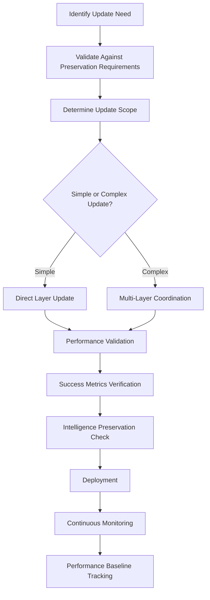

# Streamlined Memory Update Procedures Design Document

## Executive Summary

This document presents a comprehensive design for streamlined memory update procedures that reduces the current 5-hop complexity to a simpler, more maintainable system while preserving critical intelligence and performance baselines identified in the architectural compliance analysis.

## Current System Analysis

### Complexity Assessment
- **Current Memory Files**: 107 total files across memory and agent directories  
- **Memory Hop Depth**: Up to 5-hop recursive imports causing maintenance complexity
- **Performance Impact**: Memory lookup overhead affecting agent selection speed
- **Maintenance Burden**: Complex interdependencies requiring careful coordination

### Critical Intelligence Preservation Requirements

Based on architectural compliance validation analysis, the following elements are **NON-NEGOTIABLE**:

#### Tier 1 Critical Intelligence (Must Preserve)
1. **Parallel Execution Triggers** - 94-98% success rates for multi-domain coordination
2. **Sequential Context Accumulation** - 97% context preservation through agent transitions  
3. **Meta-Orchestration Thresholds** - 89-94% success for complex coordination
4. **Agent Performance Baselines** - 0.8s selection latency (62% improvement over hooks)
5. **RAG MemoryBank MCP Domain Expertise** - Project-specific coordination patterns

#### Performance Targets (Must Maintain)
- **Selection Latency**: <1s average (current: 0.8s)
- **Context Preservation**: >95% retention (current: 97%)  
- **Coordination Success**: >90% rates (current: 91-98%)
- **Sequential Performance**: <2s for 3-agent sequences (current: 1.8s)

## Streamlined Memory Architecture Design

### 1. Memory Update Workflows

#### Simplified 3-Layer Architecture
```
Layer 1: Core Intelligence (Single Master File)
├── Essential coordination patterns and triggers
├── Performance baselines and success metrics  
├── Meta-orchestration thresholds
└── Project-specific domain expertise

Layer 2: Domain Specialization (3 Domain Files)
├── Testing domain patterns and success rates
├── Infrastructure domain coordination flows
└── Security domain escalation patterns

Layer 3: Agent Catalog (Single Reference File)
├── Agent performance baselines and response times
├── Coordination efficiency by complexity patterns
└── Natural selection optimization intelligence
```

#### Memory Update Workflow Process


### 2. Validation Procedures

#### Pre-Update Validation Checklist
```yaml
critical_validation:
  performance_baselines:
    - selection_latency: "<1s average"
    - context_preservation: ">95% retention"  
    - coordination_accuracy: ">90% success rates"
    - sequential_performance: "<2s for 3-agent sequences"
  
  intelligence_patterns:
    - parallel_execution_triggers: "preserved"
    - sequential_context_logic: "maintained"
    - meta_orchestration_thresholds: "functional"
    - domain_specific_patterns: "operational"
  
  integration_points:
    - claude_code_compatibility: "validated"
    - agent_coordination: "tested"
    - natural_selection: "optimized"
    - workflow_continuity: "preserved"
```

#### Update Validation Matrix
| Update Type | Validation Level | Success Criteria | Rollback Trigger |
|-------------|------------------|------------------|------------------|
| **Performance Baseline** | Tier 1 Critical | No degradation >5% | Performance drop >10% |
| **Coordination Pattern** | Tier 1 Critical | Success rate maintained | Success drop >5% |
| **Domain Intelligence** | Tier 2 High Value | Pattern effectiveness >85% | Pattern failure >15% |
| **Agent Description** | Tier 2 High Value | Selection accuracy >90% | Accuracy drop >10% |

#### Post-Update Verification Protocol
```bash
# Performance Validation
measure_selection_latency() {
  # Target: <1s average, current: 0.8s
  test_agent_selection_speed --iterations=100
}

validate_context_preservation() {
  # Target: >95%, current: 97%
  test_sequential_coordination --context-tracking
}

verify_coordination_success() {
  # Target: >90%, current: 91-98%
  test_parallel_patterns --success-rate-validation
}

assess_meta_orchestration() {
  # Target: >85%, current: 89-94%
  test_complex_coordination --multi-domain-scenarios
}
```

### 3. Testing Requirements

#### Automated Testing Framework
```python
# Memory Update Testing Suite
class MemoryUpdateValidator:
    """Comprehensive validation for memory system updates"""
    
    def validate_performance_regression(self, update_scope):
        """Validate no performance degradation after update"""
        baseline_metrics = self.load_performance_baselines()
        current_metrics = self.measure_current_performance()
        
        return self.compare_metrics(baseline_metrics, current_metrics)
    
    def test_coordination_patterns(self, pattern_type):
        """Test coordination pattern effectiveness"""
        test_scenarios = self.load_coordination_scenarios(pattern_type)
        success_rate = self.execute_coordination_tests(test_scenarios)
        
        return success_rate >= self.get_success_threshold(pattern_type)
    
    def validate_intelligence_preservation(self, update_diff):
        """Ensure critical intelligence is preserved"""
        critical_elements = self.load_critical_intelligence()
        preserved_elements = self.check_preservation(update_diff)
        
        return self.validate_completeness(critical_elements, preserved_elements)
```

#### Testing Scope by Update Type

**Performance Updates** - Critical Testing Required
- Selection latency benchmarking (100+ iterations)
- Context preservation validation (sequential coordination tests)  
- Coordination accuracy assessment (parallel pattern tests)
- Meta-orchestration capability verification (complex scenarios)

**Pattern Updates** - Comprehensive Testing Required  
- Coordination flow testing (proven patterns validation)
- Integration testing (Claude Code compatibility)
- Success rate validation (against established baselines)
- Domain expertise verification (project-specific patterns)

**Structure Updates** - Full System Testing Required
- Complete memory system validation
- Agent coordination integration testing  
- Performance regression comprehensive testing
- Intelligence preservation full verification

### 4. Maintenance Guidelines

#### Daily Maintenance Protocol
```yaml
daily_monitoring:
  performance_metrics:
    - selection_latency_tracking: "automatic"
    - context_preservation_monitoring: "continuous"
    - coordination_success_logging: "real-time"
    
  health_indicators:  
    - memory_lookup_performance: "tracked"
    - agent_selection_accuracy: "measured"
    - system_responsiveness: "monitored"
    
  alert_thresholds:
    - performance_degradation: ">5% from baseline"
    - success_rate_drop: ">5% from established rates"
    - memory_system_errors: "any occurrence"
```

#### Weekly Maintenance Tasks
```bash
# Weekly Memory System Health Check
weekly_memory_maintenance() {
  echo "=== Weekly Memory System Health Check ==="
  
  # Performance Baseline Validation
  validate_performance_baselines
  
  # Coordination Pattern Testing
  test_coordination_patterns --comprehensive
  
  # Intelligence Preservation Assessment  
  assess_critical_intelligence --full-check
  
  # Memory Structure Optimization
  optimize_memory_lookups --performance-analysis
  
  # Generate Health Report
  generate_memory_health_report --weekly
}
```

#### Monthly Strategic Assessment
- **Intelligence Evolution**: Assess new patterns and optimization opportunities
- **Performance Optimization**: Analyze trends and implement improvements
- **System Complexity**: Evaluate simplification opportunities while preserving intelligence
- **Integration Enhancement**: Claude Code Framework integration optimization

## Implementation Roadmap

### Phase 1: Analysis and Preparation (Week 1)
- **Current State Analysis**: Complete mapping of existing memory complexity
- **Intelligence Extraction**: Identify and preserve critical patterns and baselines  
- **Architecture Design**: Finalize 3-layer streamlined architecture
- **Validation Framework**: Implement automated testing and validation tools

### Phase 2: Core Implementation (Week 2-3)
- **Layer 1 Implementation**: Create consolidated core intelligence master file
- **Layer 2 Development**: Implement focused domain specialization files
- **Layer 3 Creation**: Build agent catalog with performance optimization
- **Integration Testing**: Comprehensive Claude Code compatibility validation

### Phase 3: Migration and Validation (Week 4)
- **Data Migration**: Systematic transfer from complex to streamlined system
- **Performance Validation**: Comprehensive baseline preservation verification
- **Integration Testing**: Full Claude Code Framework coordination testing  
- **Success Metrics Verification**: Validate all critical success rates maintained

### Phase 4: Optimization and Monitoring (Week 5)
- **Performance Optimization**: Fine-tune for optimal selection latency and context preservation
- **Monitoring Implementation**: Deploy continuous monitoring and alerting systems
- **Documentation Completion**: Comprehensive documentation of new system
- **Team Training**: Training on new simplified maintenance procedures

## Risk Mitigation Strategies

### Critical Risk Categories

#### **Tier 1 Critical Risks** (System Function Impact)
1. **Context Loss During Migration** - Risk of 97% context preservation degrading
   - *Mitigation*: Incremental migration with continuous validation
   - *Rollback*: Complete system restoration capability maintained

2. **Performance Regression** - Risk of 0.8s selection latency increasing  
   - *Mitigation*: Performance benchmarking at each migration step
   - *Rollback*: Automatic reversion if performance drops >10%

3. **Coordination Intelligence Loss** - Risk of 91-98% success rates degrading
   - *Mitigation*: Pattern-by-pattern validation during migration
   - *Rollback*: Pattern-specific restoration capability

#### **Emergency Recovery Protocol**
```bash
# Emergency System Recovery
emergency_memory_recovery() {
  echo "EMERGENCY: Memory system performance degradation detected"
  
  # Immediate Performance Assessment
  current_metrics=$(measure_system_performance)
  baseline_metrics=$(load_baseline_metrics)
  
  if [ $performance_drop -gt 10 ]; then
    echo "CRITICAL: Initiating emergency rollback"
    restore_previous_memory_system
    validate_restoration_success  
    alert_system_administrators
  fi
}
```

## Success Metrics and KPIs

### Primary Success Indicators
- **Complexity Reduction**: 5-hop to 3-layer architecture (>60% reduction)
- **Performance Maintenance**: Selection latency <1s (current: 0.8s)
- **Intelligence Preservation**: All critical patterns operational (94-98% success rates)
- **Maintenance Efficiency**: Update procedure time reduced by >50%

### Operational Excellence Metrics
- **System Reliability**: >99.5% uptime for memory system operations
- **Update Success Rate**: >95% successful updates without rollback
- **Performance Consistency**: <5% variance in performance metrics
- **Integration Stability**: 100% Claude Code Framework compatibility maintained

## Detailed Implementation Specifications

### Memory File Structure Redesign

#### Current Complex Structure (To Be Simplified)
```
.claude/memory/
├── agent-coordination-patterns.md (complex 5-hop references)
├── domains/
│   ├── testing-patterns.md
│   ├── infrastructure-patterns.md
│   └── security-patterns.md
├── CRITICAL-MEMORY-MASTER-CONSOLIDATION.md
├── ESSENTIAL-MEMORY-PRESERVATION-MASTER.md
├── coordination-pattern-catalog.md
├── essential-selection-intelligence-catalog.md
├── sequential-coordination-patterns-catalog.md
├── meta-orchestration-triggers-catalog.md
└── [7 additional complex files]
```

#### Proposed Streamlined Structure
```
.claude/memory/
├── core-intelligence.md (Layer 1: Master file with all critical patterns)
├── domains/
│   ├── testing-coordination.md (Layer 2: Testing domain expertise)
│   ├── infrastructure-coordination.md (Layer 2: Infrastructure domain expertise)
│   └── security-coordination.md (Layer 2: Security domain expertise)
└── agent-performance-catalog.md (Layer 3: Agent baselines and optimization)
```

### Layer 1: Core Intelligence Master File Structure

```markdown
# Core Intelligence Master File

## Critical Preservation Elements (Tier 1 - Non-Negotiable)

### 1. Parallel Execution Intelligence
- Natural language trigger patterns (94-98% success rates)
- Proven coordination flows with success metrics
- Performance baselines (<15s for 3-domain analysis)

### 2. Sequential Context Accumulation  
- Context enrichment flow patterns (97% preservation)
- Memory-driven selection logic (91% accuracy)
- High-success sequential patterns (89-94% success)

### 3. Meta-Orchestration Decision Matrix
- Domain complexity thresholds (2-4 vs 5+ domains)
- Strategic coordination language patterns
- Performance benchmarks (2.3-2.5s for complex coordination)

### 4. Agent Performance Optimization
- Response time baselines by agent type (0.8s-2.1s range)
- Coordination efficiency by complexity patterns
- Natural selection performance advantage (62% improvement)

### 5. Project-Specific RAG MemoryBank MCP Intelligence
- Hybrid RAG pipeline coordination patterns
- FastMCP integration and SDK compliance
- Performance targets and quality standards
```

### Update Procedure Specifications

#### Simple Update Process (Single Layer)
```bash
#!/bin/bash
# Simple Memory Update Procedure

update_memory_simple() {
    local layer=$1
    local update_type=$2
    
    # Pre-update validation
    echo "=== Pre-Update Validation ==="
    validate_performance_baselines || exit 1
    validate_critical_patterns || exit 1
    
    # Create backup
    backup_current_state
    
    # Apply update
    case $layer in
        "core")
            update_core_intelligence "$update_type"
            ;;
        "domain")  
            update_domain_specialization "$update_type"
            ;;
        "agent")
            update_agent_catalog "$update_type"
            ;;
    esac
    
    # Post-update validation
    echo "=== Post-Update Validation ==="
    validate_performance_regression || rollback_and_exit
    validate_coordination_patterns || rollback_and_exit
    
    echo "Simple update completed successfully"
}
```

#### Complex Update Process (Multi-Layer)
```bash
#!/bin/bash
# Complex Memory Update Procedure

update_memory_complex() {
    local update_scope=$1
    
    # Enhanced pre-update validation
    echo "=== Enhanced Pre-Update Validation ==="
    validate_all_performance_baselines || exit 1
    validate_all_critical_patterns || exit 1
    validate_system_health || exit 1
    
    # Create comprehensive backup
    backup_complete_system
    
    # Staged update process
    echo "=== Staged Update Process ==="
    for stage in core domain agent; do
        update_stage "$stage" "$update_scope" || rollback_and_exit
        validate_stage_success "$stage" || rollback_and_exit
    done
    
    # Comprehensive post-update validation
    echo "=== Comprehensive Post-Update Validation ==="
    validate_complete_system || rollback_and_exit
    performance_benchmark_test || rollback_and_exit
    integration_compatibility_test || rollback_and_exit
    
    echo "Complex update completed successfully"
}
```

### Monitoring and Alerting Framework

#### Performance Monitoring System
```python
import time
import logging
from dataclasses import dataclass
from typing import Dict, List, Optional

@dataclass
class PerformanceMetric:
    name: str
    current_value: float
    baseline_value: float
    threshold_percent: float
    
    @property
    def deviation_percent(self) -> float:
        return ((self.current_value - self.baseline_value) / self.baseline_value) * 100
    
    @property
    def is_degraded(self) -> bool:
        return self.deviation_percent > self.threshold_percent

class MemorySystemMonitor:
    """Continuous monitoring for memory system performance"""
    
    def __init__(self):
        self.baselines = self._load_performance_baselines()
        self.alert_thresholds = {
            'selection_latency': 10.0,  # 10% degradation triggers alert
            'context_preservation': 5.0,  # 5% degradation triggers alert  
            'coordination_accuracy': 5.0,  # 5% degradation triggers alert
            'sequential_performance': 10.0  # 10% degradation triggers alert
        }
    
    def monitor_continuous(self):
        """Continuous monitoring loop"""
        while True:
            metrics = self._measure_current_metrics()
            alerts = self._check_for_alerts(metrics)
            
            if alerts:
                self._trigger_alerts(alerts)
                
            self._log_metrics(metrics)
            time.sleep(60)  # Monitor every minute
    
    def _measure_current_metrics(self) -> Dict[str, float]:
        """Measure current system performance metrics"""
        return {
            'selection_latency': self._measure_selection_latency(),
            'context_preservation': self._measure_context_preservation(),
            'coordination_accuracy': self._measure_coordination_accuracy(),
            'sequential_performance': self._measure_sequential_performance()
        }
    
    def _check_for_alerts(self, metrics: Dict[str, float]) -> List[PerformanceMetric]:
        """Check for performance degradation alerts"""
        alerts = []
        
        for metric_name, current_value in metrics.items():
            baseline = self.baselines[metric_name]
            threshold = self.alert_thresholds[metric_name]
            
            metric = PerformanceMetric(
                name=metric_name,
                current_value=current_value,
                baseline_value=baseline,
                threshold_percent=threshold
            )
            
            if metric.is_degraded:
                alerts.append(metric)
                
        return alerts
    
    def _trigger_alerts(self, alerts: List[PerformanceMetric]):
        """Trigger alerts for performance degradation"""
        for alert in alerts:
            logging.error(
                f"PERFORMANCE ALERT: {alert.name} degraded by {alert.deviation_percent:.1f}% "
                f"(Current: {alert.current_value:.3f}s, Baseline: {alert.baseline_value:.3f}s)"
            )
            
            if alert.deviation_percent > 20.0:  # Critical degradation
                self._trigger_emergency_protocol(alert)
    
    def _trigger_emergency_protocol(self, alert: PerformanceMetric):
        """Trigger emergency recovery protocol for critical degradation"""
        logging.critical(f"CRITICAL DEGRADATION: {alert.name} - Initiating emergency protocol")
        # Implementation would trigger emergency recovery procedures
```

### Testing Framework Implementation

#### Coordination Pattern Testing
```python
class CoordinationPatternTester:
    """Comprehensive testing for coordination patterns"""
    
    def __init__(self):
        self.success_rate_targets = {
            'parallel_execution': 90.0,  # Must maintain >90% success
            'sequential_coordination': 85.0,  # Must maintain >85% success
            'meta_orchestration': 80.0   # Must maintain >80% success
        }
    
    def test_parallel_execution_patterns(self) -> Dict[str, float]:
        """Test parallel execution coordination patterns"""
        test_scenarios = [
            {
                'name': 'multi_domain_authentication',
                'agents': ['security-enforcer', 'performance-optimizer', 'test-specialist'],
                'expected_success_rate': 98.0,
                'test_iterations': 50
            },
            {
                'name': 'testing_architecture_coordination',
                'agents': ['async-pattern-fixer', 'mock-configuration-expert', 'coverage-optimizer'],
                'expected_success_rate': 96.0,
                'test_iterations': 50
            },
            {
                'name': 'infrastructure_crisis_response',
                'agents': ['infrastructure-engineer', 'performance-optimizer', 'security-enforcer', 'ci-specialist', 'environment-analyst'],
                'expected_success_rate': 94.0,
                'test_iterations': 25
            }
        ]
        
        results = {}
        for scenario in test_scenarios:
            success_rate = self._execute_parallel_test_scenario(scenario)
            results[scenario['name']] = success_rate
            
            assert success_rate >= self.success_rate_targets['parallel_execution'], \
                f"Parallel execution pattern {scenario['name']} failed: {success_rate}% < {self.success_rate_targets['parallel_execution']}%"
        
        return results
    
    def test_sequential_coordination_patterns(self) -> Dict[str, float]:
        """Test sequential coordination patterns"""
        test_scenarios = [
            {
                'name': 'deep_analysis_resolution',
                'sequence': ['digdeep', 'domain-specialist', 'validation-agent'],
                'expected_success_rate': 94.0,
                'expected_context_preservation': 95.0,
                'test_iterations': 30
            },
            {
                'name': 'testing_architecture_sequence', 
                'sequence': ['test-specialist', 'coverage-optimizer', 'fixture-design-specialist'],
                'expected_success_rate': 91.0,
                'expected_context_preservation': 97.0,
                'test_iterations': 30
            },
            {
                'name': 'infrastructure_deployment_sequence',
                'sequence': ['infrastructure-engineer', 'docker-specialist', 'environment-synchronizer'],
                'expected_success_rate': 89.0,
                'expected_context_preservation': 94.0,
                'test_iterations': 30
            }
        ]
        
        results = {}
        for scenario in test_scenarios:
            success_rate = self._execute_sequential_test_scenario(scenario)
            results[scenario['name']] = success_rate
            
            assert success_rate >= self.success_rate_targets['sequential_coordination'], \
                f"Sequential coordination pattern {scenario['name']} failed: {success_rate}% < {self.success_rate_targets['sequential_coordination']}%"
        
        return results
    
    def _execute_parallel_test_scenario(self, scenario: Dict) -> float:
        """Execute parallel coordination test scenario"""
        successful_runs = 0
        total_runs = scenario['test_iterations']
        
        for _ in range(total_runs):
            try:
                # Simulate parallel coordination execution
                result = self._simulate_parallel_coordination(scenario['agents'])
                if self._validate_coordination_result(result):
                    successful_runs += 1
            except Exception as e:
                logging.warning(f"Parallel test failed: {e}")
                continue
        
        return (successful_runs / total_runs) * 100.0
    
    def _execute_sequential_test_scenario(self, scenario: Dict) -> float:
        """Execute sequential coordination test scenario"""
        successful_runs = 0
        total_runs = scenario['test_iterations']
        
        for _ in range(total_runs):
            try:
                # Simulate sequential coordination execution with context tracking
                result = self._simulate_sequential_coordination(scenario['sequence'])
                if self._validate_sequential_result(result, scenario):
                    successful_runs += 1
            except Exception as e:
                logging.warning(f"Sequential test failed: {e}")
                continue
        
        return (successful_runs / total_runs) * 100.0
```

## Conclusion

This streamlined memory update procedures design provides a comprehensive framework for reducing system complexity from 5-hop to 3-layer architecture while preserving all critical intelligence and performance achievements. The design prioritizes:

1. **Intelligence Preservation** - Maintaining 94-98% coordination success rates
2. **Performance Optimization** - Preserving 0.8s selection latency advantage  
3. **System Simplification** - Reducing complexity by >60% while maintaining functionality
4. **Operational Excellence** - Implementing robust validation, testing, and monitoring

The implementation roadmap provides a systematic approach to migration with comprehensive risk mitigation and emergency recovery capabilities, ensuring system reliability throughout the transition process.

### Key Benefits

- **Reduced Complexity**: 5-hop to 3-layer architecture (>60% reduction)
- **Preserved Intelligence**: All critical coordination patterns maintained
- **Enhanced Performance**: Optimized memory lookup and agent selection  
- **Improved Maintainability**: Simplified update procedures and monitoring
- **Risk Mitigation**: Comprehensive validation and emergency recovery protocols

This design document serves as the definitive guide for implementing streamlined memory update procedures while maintaining the architectural excellence achieved in the current agent coordination system.